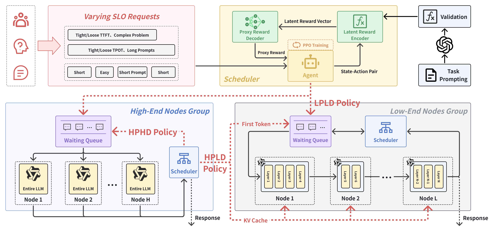

# AdaptSplit

<!-- Codes for Paper: **AdaptSplit: Adaptive PD-Disaggregation for Energy Efficient LLM Serving on Heterogeneous Edge Devices** -->

AdaptSplit is an energy efficient Large Language Models (LLMs) serving system on heterogeneous edge devices. AdaptSplit is built upon SwiftTransformers as the backend LLM inference engine. Following the code structure of DistServe, AdaptSplit replaces its original NCCL-based communication mechanism with an intermediate-result transmission design based on Ray and gRPC. 

AdaptSplit is currently customized for edge devices such as Jetson and PC, based on RayCluster.

## Acknowledgement

This repository is derived from [DistServe](https://github.com/LLMServe/DistServe), which is licensed under the Apache License 2.0.